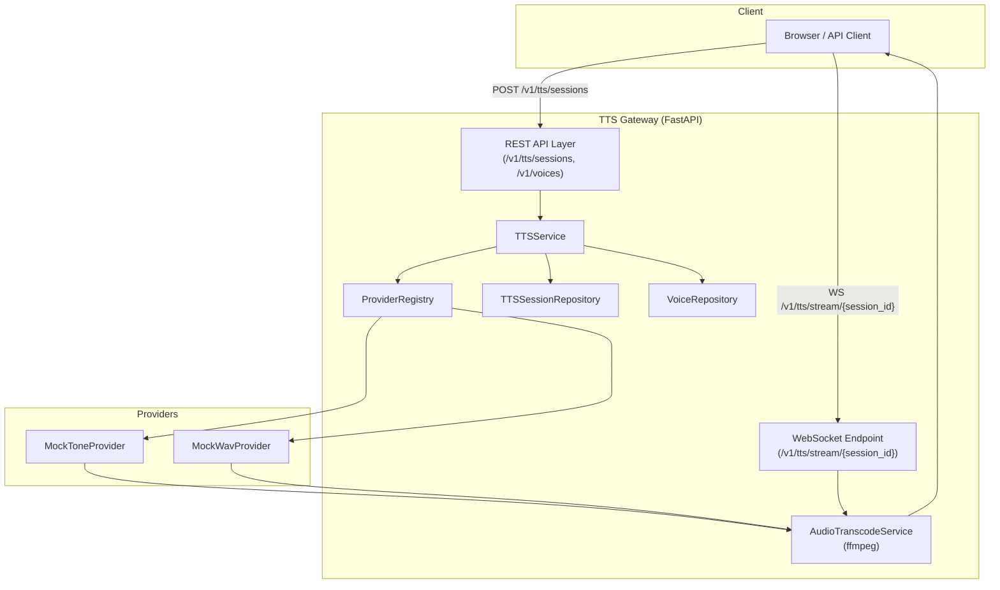

# TTS Gateway – Minimal Architecture Diagram

---

## Component Descriptions

### Browser / API Client (`C`)

- Function: Initiates TTS sessions over HTTP and consumes streamed audio over WebSocket.
- Expects: API URL, text, provider ID, voice ID, target format, sample rate.
- Exchanges: Sends REST requests to `REST API Layer`; opens WebSocket to `WebSocket Endpoint` and receives ordered audio chunks plus EOS.

### REST API Layer (`APIHTTP`)

- Function: HTTP entrypoint for creating TTS sessions and listing voices.
- Expects: JSON bodies/queries matching `CreateTTSSessionRequest` and voices filters (`provider`, `language`).
- Exchanges: Passes validated requests to `TTSService` and returns `session_id` + `ws_url` or voice lists back to the client.

### WebSocket Endpoint (`APIWS`)

- Function: Maintains per-session WebSocket connections and pushes audio chunks to clients.
- Expects: A valid `session_id` in the URL and an existing `TTSSession`.
- Exchanges: Pulls transcoded audio chunks from `AudioTranscodeService` (via `TTSService` orchestration) and sends `audio` and `eos` messages to the client.

### TTSService (`SVC`)

- Function: Core orchestration for session creation and streaming lifecycle.
- Expects: Validated session requests from `REST API Layer` and session lookups from `WebSocket Endpoint`.
- Exchanges: Reads/writes `TTSSessionRepository`, resolves providers via `ProviderRegistry`, feeds raw chunks into `AudioTranscodeService`, and surfaces stream results/metadata back to the API layer.

### ProviderRegistry (`REG`)

- Function: Registry/factory mapping provider IDs to concrete provider clients.
- Expects: Provider identifiers such as `"mock_tone"` or `"mock_wav"` from `TTSService`.
- Exchanges: Returns bound instances of `MockToneProvider`, `MockWavProvider`, or other providers to `TTSService` for streaming.

### AudioTranscodeService (`TRANS`)

- Function: Performs on-the-fly transcoding and resampling (e.g., via `ffmpeg`).
- Expects: Raw audio chunks (typically PCM16) plus target format and sample rate from `TTSService`.
- Exchanges: Emits encoded audio chunks in the requested format back to `TTSService` / `WebSocket Endpoint`, which then forwards them to the client.

### TTSSessionRepository (`SESSREPO`)

- Function: Stores and retrieves TTS session metadata for active/finished sessions.
- Expects: `TTSSession` objects with IDs, provider/voice/text, format, and status from `TTSService`.
- Exchanges: Provides session lookup and status updates to `TTSService` and the `WebSocket Endpoint`.

### VoiceRepository (`VOICEREPO`)

- Function: Catalog of available voices across providers.
- Expects: Voice definitions (ID, name, language, formats, sample rate) loaded at startup or from providers.
- Exchanges: Supplies filtered voice lists to `TTSService` / `REST API Layer` for the `/v1/voices` endpoint.

### MockToneProvider (`P1`)

- Function: Mock provider that synthesizes simple generated tones as an audio stream.
- Expects: Normalized text, voice ID, language, base format (e.g., PCM16) from `TTSService`.
- Exchanges: Streams raw audio chunks to `AudioTranscodeService` via `TTSService`, along with basic metadata (sample rate, channels).

### MockWavProvider (`P2`)

- Function: Mock provider that streams chunks of a static WAV file.
- Expects: Request parameters similar to `MockToneProvider`, typically mapped to a chosen WAV asset.
- Exchanges: Reads WAV data in chunks and passes them to `AudioTranscodeService` via `TTSService` for re-encoding and delivery to the client.
