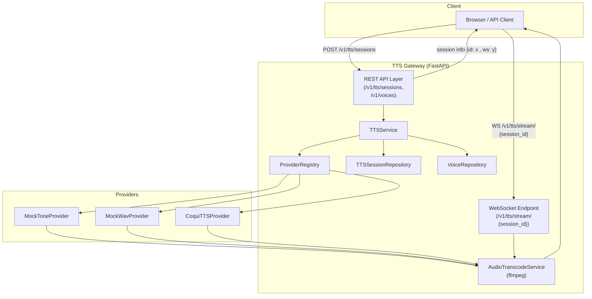

# TTS Gateway – High Level Architecture

This document describes the main components, inheritance / interfaces, and how
they communicate. Detailed protocol and process diagrams live in `diagrams/`.

High level:

- A browser client talks to a React/Vite frontend.
- The frontend calls a FastAPI TTS Gateway over HTTP and WebSocket.
- The gateway orchestrates providers, transcoding, and chunked audio streaming.
- Providers implement a common interface so new TTS engines can be plugged in.

For protocol-level flows and core logic diagrams, see:

- `diagrams/system_overview.md` – end-to-end topology (client → frontend → gateway → providers).
- `diagrams/backend_components.md` – internal FastAPI / service / repository layout.
- `diagrams/providers.md` – provider interface, inheritance, and registry.
- `diagrams/transcoding.md` – AudioTranscodeService and ffmpeg pipeline.
- `diagrams/streaming.md` – chunked streaming over WebSocket.

---

## Top-Level Components

- `Browser / API Client`
  - Initiates TTS sessions and consumes streamed audio.
  - Talks only to the frontend (in browser) and the gateway’s public HTTP/WS API.

- `Frontend (React/Vite)`
  - Renders the UI, collects text + provider/voice/format options.
  - calls backend REST server
  - Calls `POST /v1/tts/sessions`, `GET /v1/voices`, then opens `WS /v1/tts/stream/{session_id}`.

- `TTS Gateway (FastAPI)`
  - Exposes REST and WebSocket endpoints (`/healthz`, `/v1/voices`, `/v1/tts/sessions`, `/v1/tts/stream/{session_id}`).
  - Delegates business logic to `TTSService`, which orchestrates sessions, providers, transcoding, and streaming.

- `Providers`
  - Concrete implementations of a shared `BaseTTSProvider` interface.
  - Include mock providers (tone, wav) and Coqui TTS, all resolved via `ProviderRegistry`.

- `Core Services`
  - `AudioTranscodeService` wraps `ffmpeg` for on-the-fly encoding / resampling.
  - `TTSSessionRepository` and `VoiceRepository` provide session and voice catalog storage.

---

## Key Interfaces and Inheritance

- `BaseTTSProvider`
  - Abstract interface for all providers.
  - Defines methods such as `id`, `list_voices`, and `stream_synthesize(...) -> AsyncIterator[AudioChunk]`.
  - Implemented by mock providers and Coqui.

- `ProviderRegistry`
  - Maps provider IDs (e.g. `"mock_tone"`, `"coqui"`) to `BaseTTSProvider` implementations.
  - Acts as a factory / registry, used by `TTSService` to resolve providers.

- `TTSService`
  - Orchestrates calls between REST/WS endpoints, repositories, providers, and transcoding.
  - Encapsulates session lifecycle: create → synthesize chunks → transcode → stream.

Details of provider interfaces, transcoding logic, and chunk streaming are
captured in:

- `diagrams/providers.md`
- `diagrams/transcoding.md`
- `diagrams/streaming.md`

# High Level Architecture 

