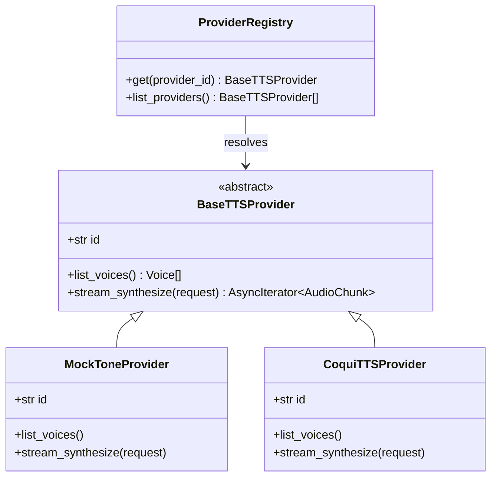

# Providers – Interface and Registry

```mermaid
classDiagram
    class BaseTTSProvider {
        <<abstract>>
        +str id
        +list_voices() Voice[]
        +stream_synthesize(request) AsyncIterator~AudioChunk~
    }

    class MockToneProvider {
        +str id
        +list_voices()
        +stream_synthesize(request)
    }

    class CoquiTTSProvider {
        +str id
        +list_voices()
        +stream_synthesize(request)
    }

    class ProviderRegistry {
        +get(provider_id) BaseTTSProvider
        +list_providers() BaseTTSProvider[]
    }

    BaseTTSProvider <|-- MockToneProvider
    BaseTTSProvider <|-- CoquiTTSProvider

    ProviderRegistry --> BaseTTSProvider : resolves
```

