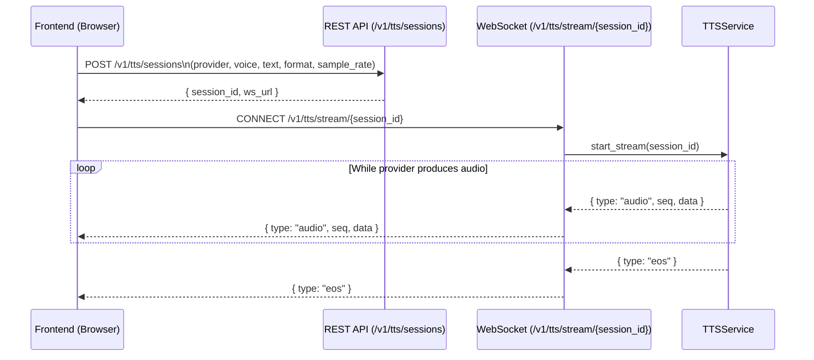

# Streaming – Chunked WebSocket Flow

```mermaid
sequenceDiagram
    participant FE as Frontend (Browser)
    participant API as REST API (/v1/tts/sessions)
    participant WS as WebSocket (/v1/tts/stream/{session_id})
    participant SVC as TTSService

    FE->>API: POST /v1/tts/sessions\n(provider, voice, text, format, sample_rate)
    API-->>FE: { session_id, ws_url }

    FE->>WS: CONNECT /v1/tts/stream/{session_id}
    WS->>SVC: start_stream(session_id)

    loop While provider produces audio
        SVC-->>WS: { type: "audio", seq, data }
        WS-->>FE: { type: "audio", seq, data }
    end

    SVC-->>WS: { type: "eos" }
    WS-->>FE: { type: "eos" }
```

