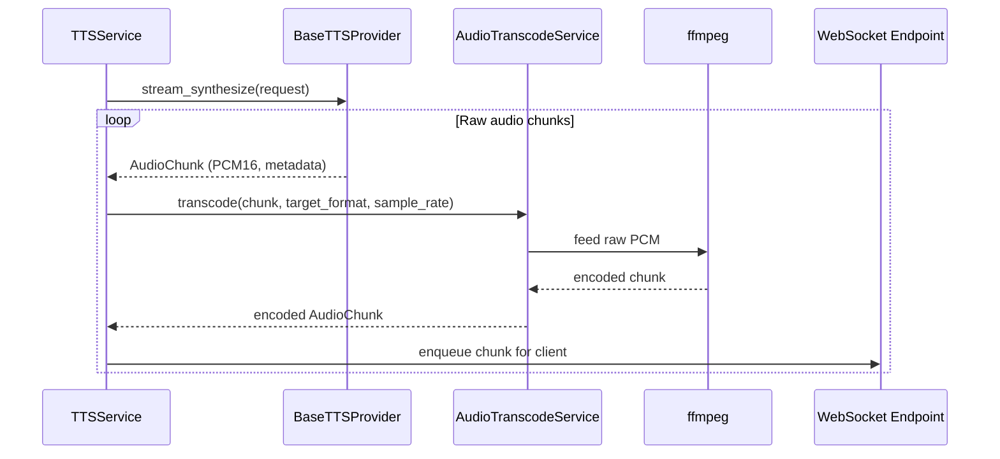

# Transcoding – AudioTranscodeService & ffmpeg

```mermaid
sequenceDiagram
    participant SVC as TTSService
    participant PRV as BaseTTSProvider
    participant TRANS as AudioTranscodeService
    participant FFMPEG as ffmpeg
    participant WS as WebSocket Endpoint

    SVC->>PRV: stream_synthesize(request)
    loop Raw audio chunks
        PRV-->>SVC: AudioChunk (PCM16, metadata)
        SVC->>TRANS: transcode(chunk, target_format, sample_rate)
        TRANS->>FFMPEG: feed raw PCM
        FFMPEG-->>TRANS: encoded chunk
        TRANS-->>SVC: encoded AudioChunk
        SVC->>WS: enqueue chunk for client
    end
```

